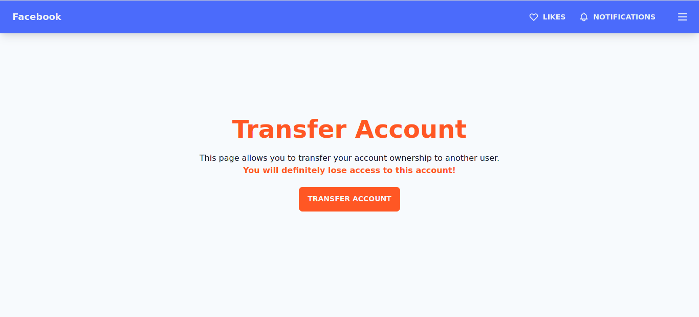

# Clickjacking Example

## Description

This repository contains an example of the clickjacking attack described by OWASP here: https://owasp.org/www-community/attacks/Clickjacking.

This attack basically consists in embedding a victim website in an iframe of a malicious website, and hide this iframe with another content but letting it still clickable. Which means that, when the user will wants to click on the fake website elements, he will actually click on the victim website ones.

Clickjacking can lead a victim to perform several actions without him knowing, like for example giving a personal information to the attacker, doing a bank transfer to him, ... or any action that could normally be possible on the target/victim website.

Although this attack seems particularly dangerous, it is really hard to implement. Primarily because it will be really hard to fake an entire website dedicated to trick the victim into doing several continued actions while keeping a natural look. There is also the fact that, because actions are performed on the invisible iframe, the content of the fake website will never change, it will for example be impossible to change the text in a form or anything... Clickjacking will indeed only be possible on victim websites in which the actions are only performed by clicking buttons.

Thankfully, many solutions against this attack exist. They will be described later. 

## Example

For this project example, two websites have been developed, you will find them in the following files:

- `facebook.html`
- `game.html`

### Victim website

`facebook.html` contains the target/victim website. It is supposed to represent an hypothetical Facebook page (it could have actually been any other online service) in which the user is offered to transfer his account ownership to another user. Although such feature seems stupid, it can look like some family control features such services offer. On this website, the user has to click on the button in the center of the screen, which will make a popup appear on the bottom-right, asking him if he really wants to proceed. When clicking on this second button, an alert will pop informing the user that he transfered his account forever.




### Malicious website

`game.html` contains the malicious website. It is supposed to embed the `facebook.html` page as an iframe and to lead the victim to successively click on the `TRANSFER ACCOUNT` and `TRANSFER` buttons. On this page, I tried to use some human biases as we often see on clickjacking websites: the shiny look that gives will to the user to go further, as well as some elements dedicated to urge the victim to get into the trap by using the words `disappear`, `fast`, etc... Finally, since this page has to trick the user into clicking on the buttons in a specific order, I put some tooltips over them to make sure the victim follows the instructions.


On the technical part, here is how I proceeded:

- I embedded the Facebook page as an iframe

  ```html
  <iframe src="facebook.html"></iframe>
  ```

- I applied some styles to this last

  ```css
  iframe { /* iframe victim site */
      width: 100%;
      height: 100%;
      position: absolute;
      top:0; left:0;
      opacity: 0; /* set to 0.5 if you want to see what happens */
      z-index: 1;
  }
  ```

  The four first lines are here to fix the iframe's position and to make it taking the entire size of the screen. The `opacity` style allows to hide the iframe's content and the `z-index` allows to put the elements at the foreground (which means, when the victim will click on the website, he will click on the iframe's contents)

- I then reused the same components used in `facebook.html` to make sure the clickjacking will still work even if the window is resized, I had to apply some styles to the modal box in order to always hide it on the screen and letting one button visible

  ```css
  #confirmation {
      visibility: hidden;
      position: absolute;
      bottom: 0; right: 0;
      transform: none;
  }
  #get-gems {
      visibility: visible;
  }
  ```

This example is really basic but I think it's good enough to give the victim the will to perform the actions we want. It's possible to change the `opacity` of the iframe in CSS to `0.5` to see what actually happens on the target website.

### Technologies

I used [Tailwind](https://tailwindcss.com/) and the [daisyUI kit](https://daisyui.com/) to develop these two pages. daisyUI offers many useful themable components to use, and it allowed me to focus on the HTML and functional part of the website, without writing too much CSS. I still had to write some CSS for the clickjacking part of the malicious website.

## Remediations

First, we can say that a "natural remediation" is that such attacks are really hard to implement on complex user interfaces. But this is not enough, and many remediations to this attack have thankfully been created.

One of the oldest is to incorporate some JavaScript code called "frame-breaker" at the website level to ensure it is not used as an iframe:

```html
<!-- ANTI CLICKJACK SECURITY -->
<style id="anti-click-jack">
    body {display:none !important;}
</style>
<script type="text/javascript">
    if (self === top) {
        const antiClickjack = document.getElementById("anti-click-jack")
        antiClickjack.parentNode.removeChild(antiClickjack)
    } else {
        top.location = self.location
    }
</script>
```

This piece of code creates a named style that is automatically hiding the whole body of the page. Then, a bit of JavaScript checks if the page is at top-level (ie. not used as an iframe), if so, the named style is disabled and the body of the page appears. Otherwise, if the site is embedded, the user is redirected to the safe website. This code is in the `facebook.html` document, you can test it by uncommenting it.

New techniques implying the web server configuration have then been invented. Here, it will be impossible to test them because I wanted a short example without the use of a web server. We can mainly note the `X-Frame-Options` HTTP header which offers the administrator to choose if he wants the website to be embedded in iframes and from which website. The legacy (but still commonly used) `X-Frame-Options` header has been replaced by the `frame-ancestors` one.

Various other defense ways are suggested by OWASP here: https://cheatsheetseries.owasp.org/cheatsheets/Clickjacking_Defense_Cheat_Sheet.html

